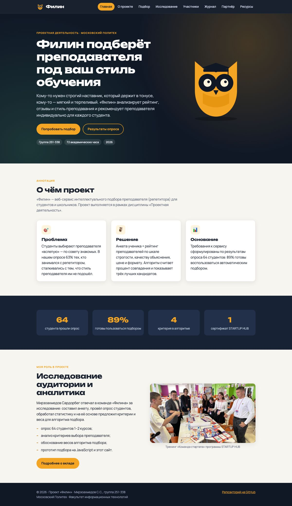
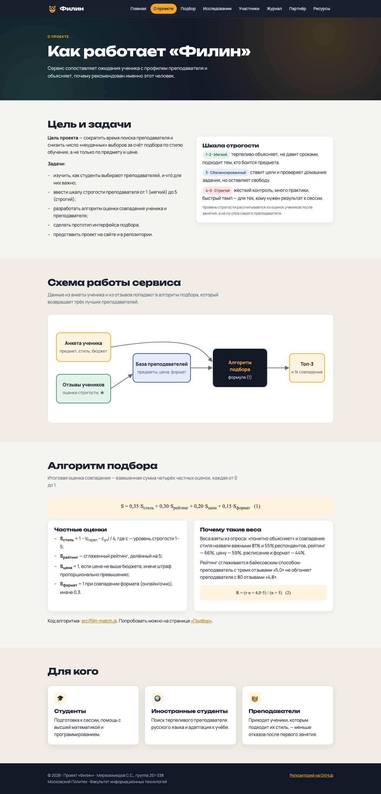
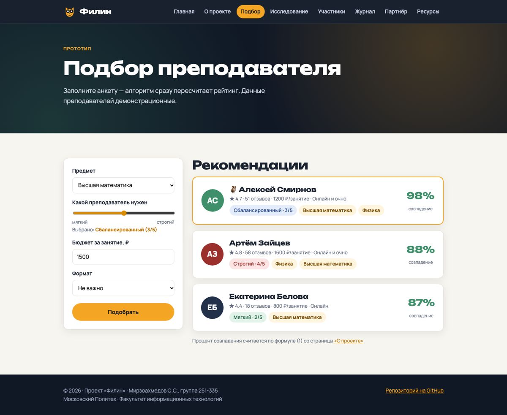
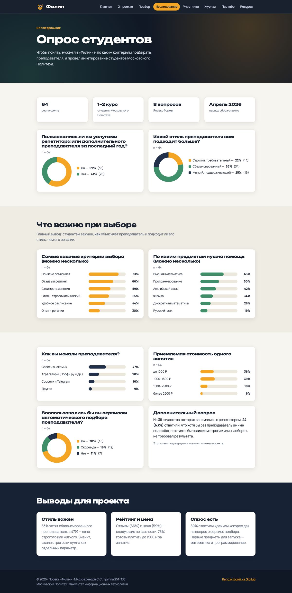

# Проектная (учебная) практика — проект «Филин»

**Сайт:** https://sardor2211-bit.github.io/practice-2025-1/

**Репозиторий:** https://github.com/sardor2211-bit/practice-2025-1

## Участники

| ФИО | Учебная группа | Код направления подготовки | Профиль образовательной программы |
|-|-|-|-|
| Мирзоахмедов Сардорбег Содикжонович | 251-335 | 09.03.04 | Программная инженерия |

Практика выполнена индивидуально.

## Задание

Задание размещено в папке **task** в файле [README.md](task/README.md).

## Проектная деятельность

Проектная (учебная) практика проводилась в связке с выполнением проекта «**Филин** — сервис подбора преподавателя под стиль обучения студента» по дисциплине «Проектная деятельность».

«Филин» подбирает ученику преподавателя не только по предмету и цене, но и по стилю преподавания — строгий или мягкий, — рейтингу и формату занятий. Роль автора в проекте — исследование аудитории: опрос студентов, анализ статистики и обоснование критериев алгоритма подбора.

Куратор по проектной деятельности: Гендон Анжелика Леонидовна.

## Вариативная часть задания

Кафедральное индивидуальное задание: исследование целевой аудитории проекта «Филин» (опрос 64 студентов) и разработка прототипа алгоритма подбора преподавателя на JavaScript с интеграцией в сайт проекта.

- анализ опроса — [docs/survey.md](docs/survey.md);
- описание алгоритма — [docs/algorithm.md](docs/algorithm.md);
- исходный код — [src/filin-match.js](src/filin-match.js).

## Ответственный по проектной (учебной) практике

Дагаев Александр Евгеньевич, кафедра «Информатика и информационные технологии».

## Период проведения

С 16 февраля 2026 г. по 23 мая 2026 г., доработка — сентябрь 2026 г.

## Структура репозитория

| Папка | Содержимое |
|-|-|
| [docs/](docs/) | документация в Markdown: ход практики, опрос, алгоритм, отчёт о взаимодействии с партнёром |
| [reports/](reports/) | отчёт по практике в DOCX и PDF |
| [site/](site/) | статический сайт проекта (HTML, CSS, JavaScript) |
| [src/](src/) | алгоритм подбора преподавателя и проверки к нему |
| [task/](task/) | текст задания |

## Как запустить сайт локально

```bash
cd site
python3 -m http.server 8000
```

После этого откройте http://localhost:8000. Сайт публикуется на GitHub Pages автоматически при каждом push в ветку `main` (см. [.github/workflows/pages.yml](.github/workflows/pages.yml)).

## Скриншоты сайта

| Главная | О проекте |
|-|-|
|  |  |
| **Подбор** | **Исследование** |
|  |  |

Скриншоты всех страниц — в папке [docs/screenshots](docs/screenshots/).
