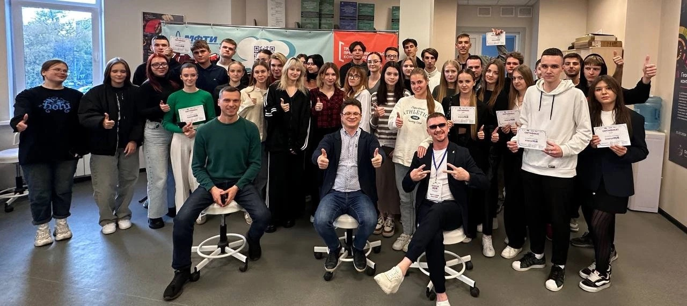
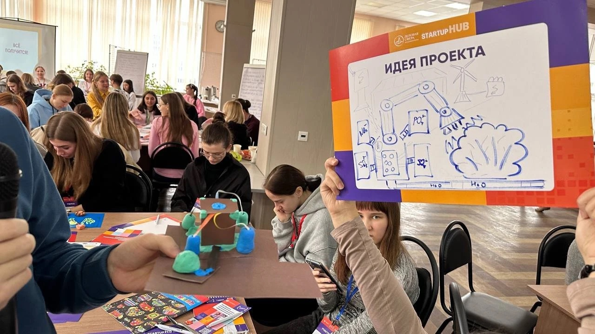
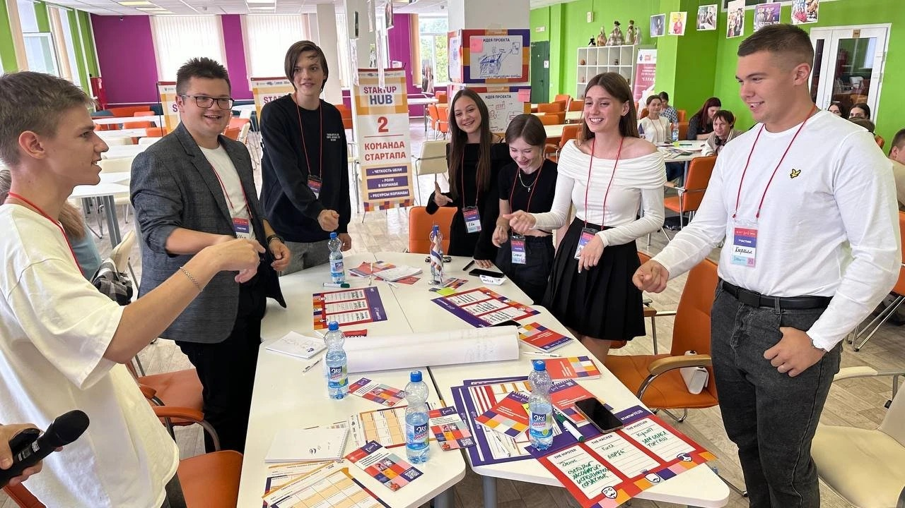

# Отчёт о взаимодействии с организацией-партнёром

## Сведения о мероприятии

| Параметр | Значение |
|-|-|
| Программа | «Тренинги предпринимательских компетенций» (STARTUP HUB) |
| Организатор | ООО «Центр развития бизнеса «Деловая сфера»», МФТИ |
| Рамки | федеральный проект «Технологии» национального проекта «Эффективная и конкурентная экономика» |
| Дата | 15 мая 2026 г. |
| Место | Московский Политех |
| Участник | Мирзоахмедов Сардорбег Содикжонович |
| Результат | сертификат участника № 8FKiKeuyRLmCF89M4 |

## Содержание программы

Программа была построена как «конвейер бизнес-идей»: команды проходили по станциям и на каждой дорабатывали свою идею.

1. **Идея проекта** — генерация и первичная оценка идеи, описание проблемы пользователя.
2. **Команда стартапа** — чёткость цели, роли в команде, ресурсы команды.
3. **MVP** — что можно сделать быстро, чтобы проверить идею на пользователях.
4. **Организационная структура и бизнес-модель** — кто платит и за что.
5. **Питч** — короткая защита идеи перед экспертами.

## Полученные знания и связь с проектом «Филин»

- **Проверка гипотез.** На тренинге объяснили, что идею нужно проверять на реальных пользователях до разработки. Это стало основанием для опроса 64 студентов ([survey.md](survey.md)).
- **MVP.** Вместо полноценной платформы с регистрацией и оплатой в рамках практики сделан прототип подбора — минимальный продукт, который можно показать пользователям.
- **Роли в команде.** Я закрепил за собой роль исследователя и аналитика и отвечал за данные, на которых строится алгоритм.
- **Бизнес-модель.** Обсудили монетизацию «Филина»: комиссия с первого занятия и платное продвижение профиля преподавателя.

## Итог

Получен сертификат участника программы ([certificate_mirzoakhmedov.pdf](certificate_mirzoakhmedov.pdf)). Знания о проверке гипотез и MVP напрямую использованы в проекте «Филин».
